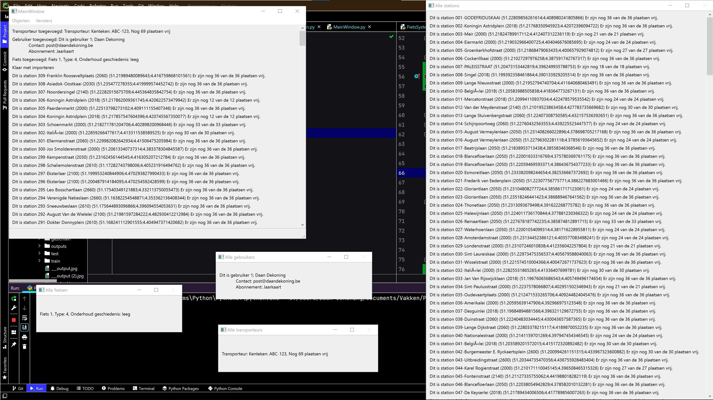

# Project 2: Fietsdeelsysteem

Tweede Python OOP project.

> Je maakt - gebruik makende van de reeds geziene OO-concepten - een  simulatie van Velo in Antwerpen. Je modelleert volgende entiteiten:  velo-station, fietsen, gebruikers en velo-transporteurs die stations  kunnen legen en bijvullen. Je zorgt er met methods voor dat fietsers een fiets kunnen uit- en inchecken. Elke beweging wordt bij de gebruiker  geregistreerd. Bij het opstarten van de toepassing script je een  "realiteit" van een met een aantal fietsen gevulde stations. Na het  aanmaken van de basis mag je zo gedetailleerd gaan als je zelf wenst:  methods die transporteurs kunnen helpen om te weten bij welk station ze  best fietsen weghalen of brengen, een gesimuleerde ochtend- of  avondspits.

> Probeer de opdracht - het Velo-systeem - verder uit te breiden: je zorgt voor een levend-ecosysteem met automatisch in- en uitcheckende  fietsers. Je maakt een simulatie waarin de tijd kan worden "versneld". Bovendien voeg je rondrijdende vrachtwagentjes toe die fietsen van een  vol station kunnen transfereren naar een leeg station. De bewegingen  mogen at random gebeuren. Je hoeft niet te werken met het reële aantal  stations maar kiest voor een simulatie met een beperkt aantal stations. Wel is het zo dat je ervoor zorgt dat de situatie "persistent" maakt in  een tekstbestand. Zodat het script niet telkens opnieuw hoeft te  beginnen.

Bij het uitvoeren van `Programma2.py` zal de GUI starten. Zie hieronder hoe deze interface eruitziet.

Momenteel kan je:

- Via `Objecten` > `Nieuw` 
  - Een nieuw `Station` toevoegen.
  - Een nieuwe `Gebruiker` toevoegen.
  - Een nieuwe `Fiets` toevoegen.
  - Een nieuwe `Transporteur` toevoegen. 
- Via `Objecten` > `Importeren`
  - Een GeoJSON bestand met stations importeren.
- Via `Vensters`
  - Alle stations weergeven.
  - Alle gebruikers weergeven.
  - Alle fietsen weergeven.
  - Alle transporteurs weergeven.

